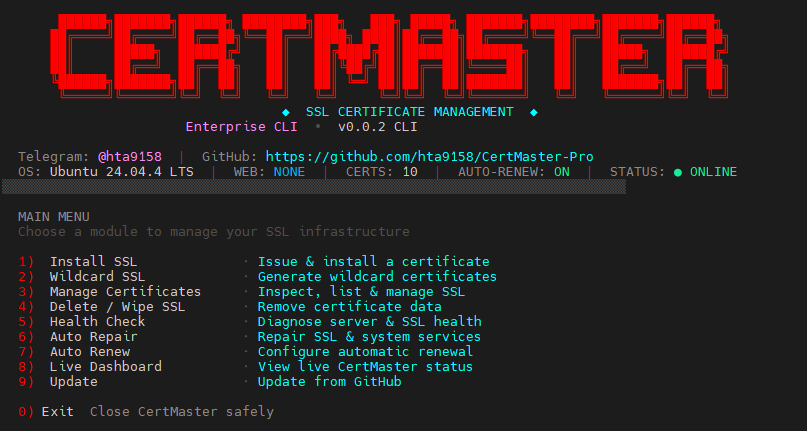

# CertMaster-Pro

<p align="center">
  
</p>

<p align="center">
  <b>Professional SSL Certificate Manager for Linux</b>
</p>

<p align="center">
  Secure • Automated • Reliable
</p>

---

## ✨ Features

- 🔐 SSL Certificate Installation
- 🌐 Wildcard SSL Certificate Support
- 📋 Managed Certificates
- 🗑️ Certificate Delete / Wipe
- 🔄 Automatic SSL Renewal
- ⏰ Auto-Renew Scheduler
- 🔍 Automatic Certificate Scanning
- 🩺 SSL & System Health Check
- 🔧 System Auto Repair
- 📊 Live Dashboard
- 🌐 Web Server Detection
- 🧪 SSL Renewal Testing
- ⬆️ Built-in GitHub Update System
- 📝 Certificate & System Logs
- 🛡️ Certbot Integration

---

## 🚀 Installation

Install CertMaster-Pro with the following commands:

```bash
# Clone the repository
git clone https://github.com/MAsterhadi/CertMaster-Pro.git ~/CertMaster-Pro

# Enter the project directory
cd ~/CertMaster-Pro

# Run the installer
sudo bash install.sh

